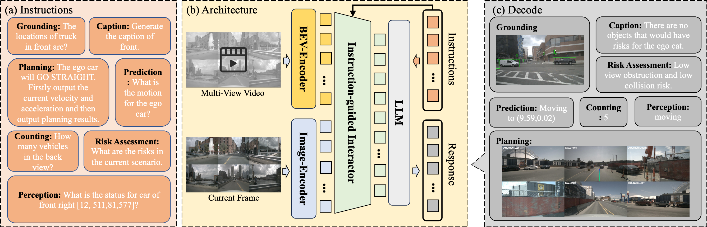

# World Knowledge-Enhanced Reasoning Using Instruction-guided Interactor in Autonomous Driving

Offical implementation for AAAI 2025 paper "World Knowledge-Enhanced Reasoning Using Instruction-guided Interactor in Autonomous Driving" [[paper link]](https://arxiv.org/pdf/2412.06324)

 

## Todo List
- [x] train code
- [ ] inference code
- [ ] eval code
- [ ] dataset

## Quick Start
### Environments
- CUDA and cuDNN

    We use CUDA 11.8 and cuDNN 8.7.0. We actually use the CUDA docker by NVIDIA: docker pull nvcr.io/nvidia/cuda:11.8.0-cudnn8-devel-ubuntu20.04. CUDA 12 is fine, too.

- Create a conda virtual environment and activate it:
    ```shell
    conda create -n kad python=3.10
    conda activate kad
    ```
- Basic requirements
    ```shell
    pip install --upgrade pip
    pip install transformers
    pip install torch torchvision xformers --index-url https://download.pytorch.org/whl/cu118
    ```
- Install flash-attention
  ```shell
  # https://github.com/Dao-AILab/flash-attention?tab=readme-ov-file#installation-and-features
  pip install packaging
  pip install flash-attn --no-build-isolation
  ```
- Install KAD and other requirements
  ```shell
  git clone https://github.com/KAD.git
  cd KAD
  pip install -e .
  ```
- Lora finetune
  ```shell
  sh ./script/train/finetune_lora.sh
  ```
- mult-node lora finetune
  ```shell
  sh ./script/train/finetune_lora_multi-nodes.sh
  ```


## Dataset
coming soon.